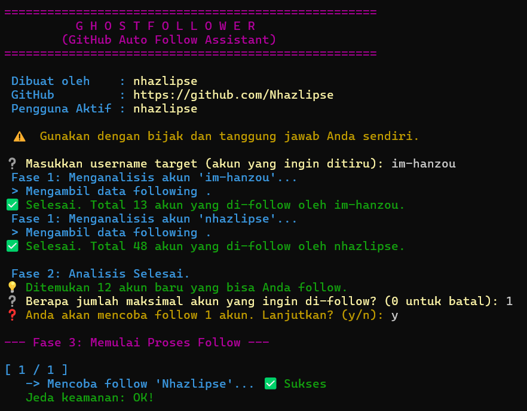

# G H O S T F O L L O W E R - GitHub Auto Follow Assistant

[](https://opensource.org/licenses/MIT)
[](https://www.python.org/downloads/)

An intelligent command-line assistant that helps you expand your GitHub network by automatically following users based on the "following" list of a target user.

**If you find this project useful, please consider giving it a ⭐ star!**

## ⚠️ A Note on Responsible Use

This tool automates actions on your GitHub account. It is designed with safety features like significant, randomized delays to respect GitHub's API and avoid spam-like behavior.

However, **this tool is only safe if you use it wisely**. Aggressively following a massive number of users can violate GitHub's Terms of Service and may lead to restrictions on your account. Use this tool responsibly, target relevant users, and do not overuse it. The developer assumes no responsibility for any misuse or consequences thereof.

## ✨ Features

-   **Targeted Following**: Automatically follows users from a specified target user's following list.
-   **Smart Conflict Resolution**: Intelligently skips users that you are already following to avoid redundant actions.
-   **Configurable Limits**: You decide the maximum number of users to follow in a single session.
-   **Human-like Delays**: Incorporates significant, randomized delays between each follow action to ensure API safety.
-   **Secure**: Manages your Personal Access Token securely using a local `.env.local` file.
-   **Engaging Interface**: A visually appealing and informative CLI that provides clear feedback on every step of the process.

## 📸 Preview



## 🚀 Getting Started

Follow these instructions to get the project up and running on your local machine.

### Prerequisites

-   [Python](https://www.python.org/downloads/) (version 3.7 or higher)
-   [Git](https://git-scm.com/downloads/)

### 🛠️ Installation & Setup

1.  **Clone the repository:**
    Open your terminal and run the following command:
    ```sh
    git clone [https://github.com/Nhazlipse/BOT-FOLLOW-GITHUB.git](https://github.com/Nhazlipse/BOT-FOLLOW-GITHUB.git)
    cd BOT-FOLLOW-GITHUB
    ```

2.  **Create a virtual environment (Recommended):**
    This keeps your project dependencies isolated.
    ```sh
    # For macOS/Linux
    python3 -m venv venv
    source venv/bin/activate

    # For Windows
    python -m venv venv
    .\venv\Scripts\activate
    ```

3.  **Install dependencies:**
    This project's dependencies are listed in `requirements.txt`.
    ```sh
    pip install -r requirements.txt
    ```

### ⚙️ Configuration

The script requires your GitHub username and a Personal Access Token (PAT) to perform follow actions on your behalf.

1.  **Create the environment file:**
    In the root directory of the project, create a new file named `.env.local`.

2.  **Add your credentials:**
    Open the `.env.local` file and add the following, replacing the placeholder values:
    ```ini
    GITHUB_USERNAME="your_github_username"
    GITHUB_TOKEN="your_personal_access_token"
    ```

3.  **How to get a Personal Access Token (PAT):**
    -   Go to **[GitHub's Personal Access Tokens settings page](https://github.com/settings/tokens/new)**.
    -   Give your token a descriptive name (e.g., "Follow Assistant Script").
    -   Set an expiration date.
    -   Under **"Select scopes"**, you **must** check the **`user:follow`** scope. This permission is required for the script to follow users on your behalf.
    -   Click **"Generate token"**.
    -   **Important:** Copy the generated token immediately and paste it into your `.env.local` file. You will not be able to see the full token again.

## ▶️ How to Use

After completing the installation and configuration, run the script from your terminal:

```sh
python main.py
```

The script will launch and prompt you to enter the username of the target account. Follow the on-screen instructions to complete the process.

📜 License
This project is licensed under the MIT License. See the LICENSE file for details.

©️ Copyright
Copyright (c) 2025 nhazlipse. All Rights Reserved.
